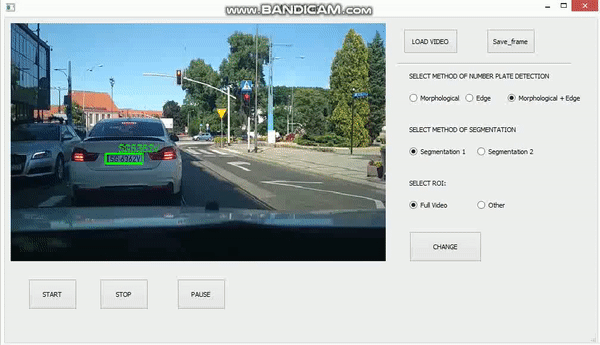
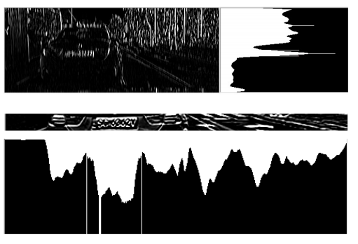
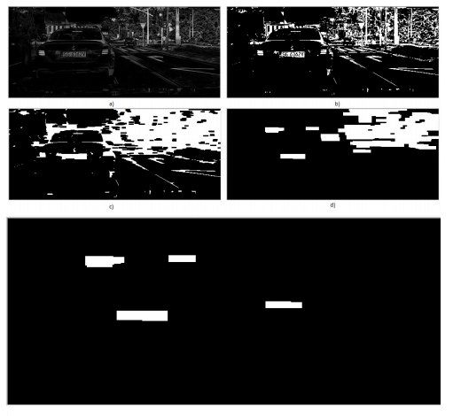
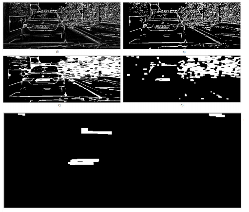
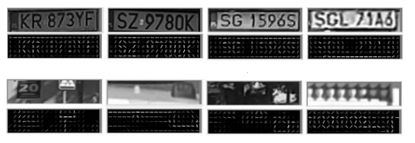
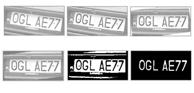
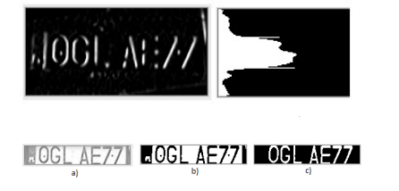
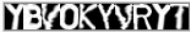
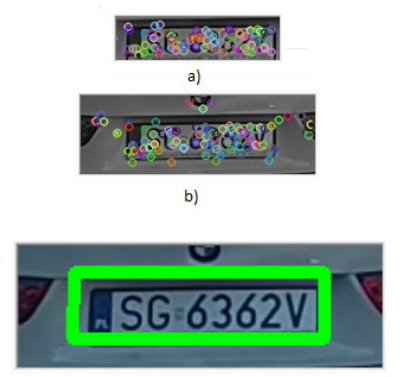
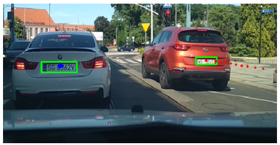

## Number Plate Detection and Recognition
It is desktop application for number plate detection and recognition in dash cam videos.
	
## Technologies
Project is created with:
* PyQt5 - to create gui
* OpenCV and NumPy
* skimage - to get algorithms which calculate hog and sift features
* scikit-learn - for machine learning purpose

## Presentation - How It Works
In the application window, there are three methods of locating the license plate, and two methods of character segmentation.
 In addition, you can select the region of interest.

#Localize algorithm 1
The first license plate location algorithm uses edge detection and brightness projections.

#Localize algorithm 2
The first license plate location algorithm uses morphological operations.

#Localize algorithm 3
The first license plate location algorithm uses edge detection and morphological operations.

#Number plate classyfication
The found areas in which the table can be are classified.
 The k nearest neighbors method was used for classification, and HOG descriptors were used as the feature vector.
 In the image below I have presented HOG descriptors for several images from my dataset that I used to teach the model.
 
 
#Segmentation algorithm
Two algorithms were also used to segregate array characters.
The first uses analysis of connected components.

In the second method, brightness projections and analysis of connected components.

#OCR
The k nearest neighbors algorithm was again used for ocr. The feature vector was built based on the brightness of each pixel.
The data set for model learning I built use the Augmentor library. You can learn more about it here: https://augmentor.readthedocs.io/en/master/index.html
Finally, I received 7,000 images in the dataset. In the picture below a few examples of characters.

#Tracking
The tracking algorithm is another important element of the system. It uses the SIFT detector to search for similar objects in the image.
 The following figure shows the license plate found and a similar object found on the next video frame.
 
 
  